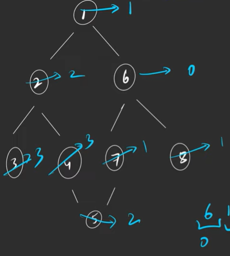
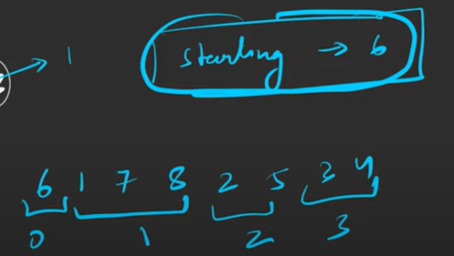
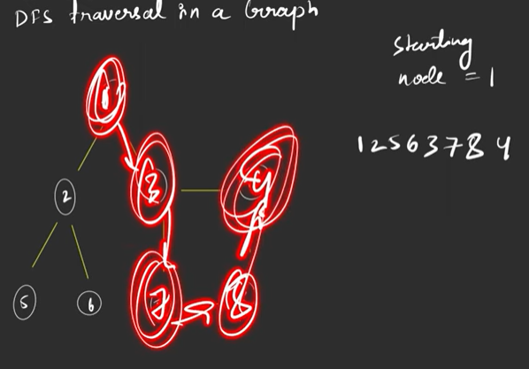
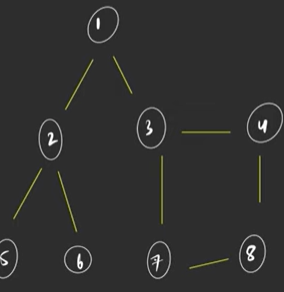
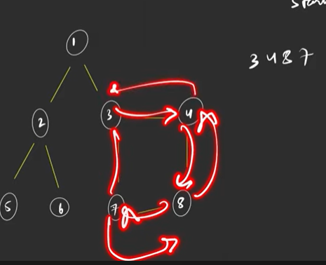
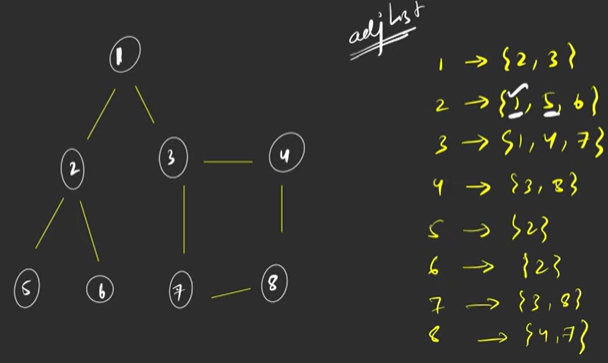
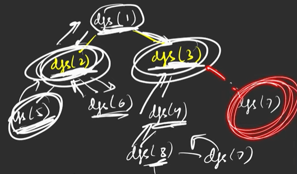

# Graphs

# Breadth First Search 
- Level wise traversal

## Pre-Requisites
1. Queue in starting that always contains the starting point - q
2. Create a visited array equal to the total number of nodes present in graph and the inde of starting node by marked as 1. - vis[]

## Algorithm
- Keep taking out from queue until the queue is empty
- For every node taken out
1. find out its neighbours using adjacency list
2. If you encounter a node whose index in vis[] is already 1 then skip its iteration.
3. Else, put these neighbouring nodes into the 'q' and mark thier indexes as 1 in vis[].

## Complexity
- space complexity: (n) -> q+vis[]+ansList - 3n.
- time complexity: (V*2E) -> node goes once in to the bfs and runs on all its degrees(neighbours) . 
V - as q goes through each node
2E - as for loop runs for each node finding it neighbours. hence will run 2 times for 1 edge.

# Depth First Search
- Explore Depths of the current path before trying alternative path.

Here lets take starting node as 3

- Many solutions possible
- Uses recursion

## Pre-Requisities
1. Visted array with starting node marked as visited. - vis[]

## Algorithm
- Call recursive dfs func. In every function call
1. Mark Vis of the  node to true
2. add the node to the dfs list
3. If index of node in vis is marked as 1 then skip
4. Else, for all neighbours of the current node and go the depth of each neighbour, complete it, comeback and run next  iteration for next neighbour.

## CodeFlow
- Graph and its adjacency list

## Complexity
- space - 
1. At max 'V' nodes visited during traversal. therefore N nodes are being stored in ans
2. 'V' space for visited array
3. for a skewed graph giving us worse case (graph which is actially a linked list), recursion space/depth will be 'V'.
- Time - 
1. in dfs func it will be called once for each node and everytime its called, it iterates through all its neighbours. 
For Undirected graph - (N + 2E)
For directed graph - (N + E)